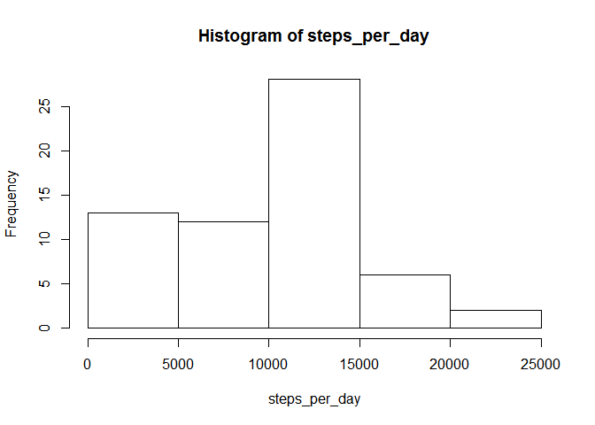
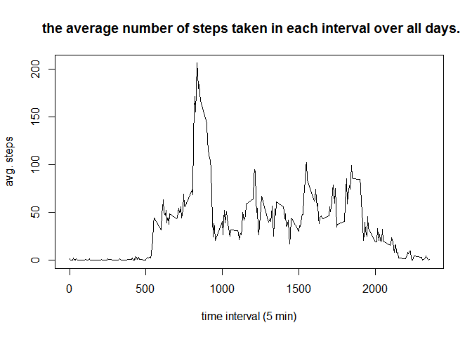
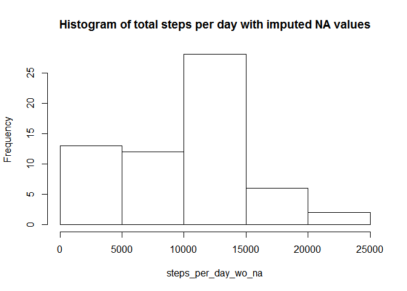
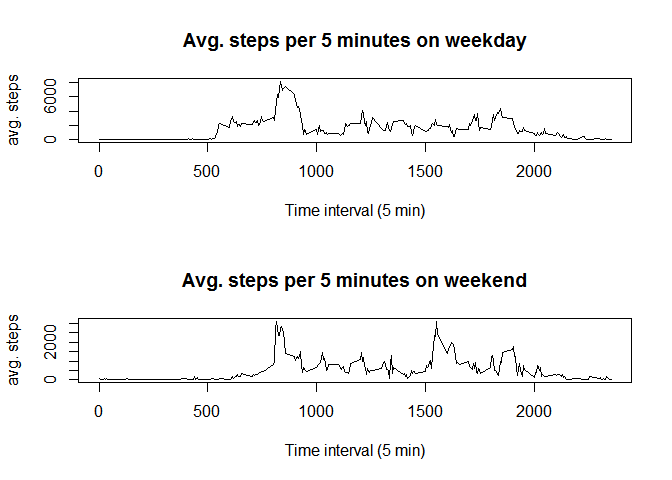

# Reproducible Research: Peer Assessment 1


## Loading and preprocessing the data
1. Load the data (i.e. read.csv()). No post process is needed here.

```r
unzip("activity.zip")
df <- read.csv("activity.csv")
```

2. No further process is needed.

## What is mean total number of steps taken per day?
1. Calculate the total number of steps taken per day

```r
steps_per_day <- tapply(df$steps, df$date, FUN = sum, na.rm = TRUE)
```

2. Make a histogram of the total number of steps taken each day

```r
hist(steps_per_day)
```

<!-- -->

3. Calculate and report the mean and median of the total number of steps taken per day

```r
mean(steps_per_day)
```

```
## [1] 9354.23
```

```r
median(steps_per_day)
```

```
## [1] 10395
```

## What is the average daily activity pattern?
1. Make a time series plot (i.e. type = "l") of the 5-minute interval (x-axis) and the average number of steps taken, averaged across all days (y-axis)

```r
steps_each_interval <- tapply(df$steps, df$interval, FUN = mean, na.rm = TRUE)
plot(df$interval[1:288], steps_each_interval, type="l",xlab = "time interval (5 min)", ylab = "avg. steps", main = " the average number of steps taken in each interval over all days.")
```

<!-- -->

2. The 5-minute interval, on average across all the days in the dataset, contains the maximum number of steps is

```r
names(which.max(steps_each_interval))
```

```
## [1] "835"
```


## Imputing missing values
1. Calculate and report the total number of missing values in the dataset

```r
sum(is.na(df))
```

```
## [1] 2304
```
2. Devise a strategy for filling in all of the missing values in the dataset. The strategy here is replacing missing value by the averaged steps on that time interval over all the days.

3. Create a new dataset, steps_wo_na, that is equal to the original dataset but with the missing data filled in.

```r
na_idx <- which(is.na(df))
df$steps_wo_na <- df$steps
df$steps_wo_na[na_idx] <- rep(steps_per_day, each = 288)[na_idx]
```
4. Make a histogram of the total number of steps taken each day and Calculate and report the mean and median total number of steps taken per day. There is no difference. The histogram is exactly the same.

```r
steps_per_day_wo_na <- tapply(df$steps_wo_na, df$date, FUN = sum, na.rm = TRUE)
hist(steps_per_day_wo_na, main = "Histogram of total steps per day with imputed NA values")
```

<!-- -->

The mean and median are also the same.

```r
mean(steps_per_day_wo_na)
```

```
## [1] 9354.23
```

```r
median(steps_per_day_wo_na)
```

```
## [1] 10395
```
The reason is that the NA values are located at the time intervals whose means are also zero. So there is no impact on the histogram.

## Are there differences in activity patterns between weekdays and weekends?
1. Create a new factor variable in the dataset with two levels - "weekday" and "weekend" indicating whether a given date is a weekday or weekend day.

```r
df$weekday<-factor(lubridate::wday(strptime(df$date, format = "%Y-%m-%d")) %in% c(1,5), labels = c("weekday","weekend"))
```

2. Make a panel plot containing a time series plot (i.e. type = "l") of the 5-minute interval (x-axis) and the average number of steps taken, averaged across all weekday days or weekend days (y-axis).

```r
df_weekday <- subset(df, df$weekday == "weekday")
df_weekend <- subset(df, df$weekday == "weekend")
steps_per_weekday <- tapply(df_weekday$steps, df_weekday$interval, FUN = sum, na.rm = TRUE)
steps_per_weekend <- tapply(df_weekend$steps, df_weekend$interval, FUN = sum, na.rm = TRUE)
par(mfrow=c(2,1))
plot(df_weekday$interval[1:288], steps_per_weekday, type = "l", xlab = "Time interval (5 min)", ylab = "avg. steps", main = "Avg. steps per 5 minutes on weekday")
plot(df_weekend$interval[1:288], steps_per_weekend, type = "l", xlab = "Time interval (5 min)", ylab = "avg. steps", main = "Avg. steps per 5 minutes on weekend")
```

<!-- -->

On weekdays, the steps increase early in the morning and remain low in the afternoon, but on the weekends, the steps increase much later in the morning and increase in the afternoon again.
